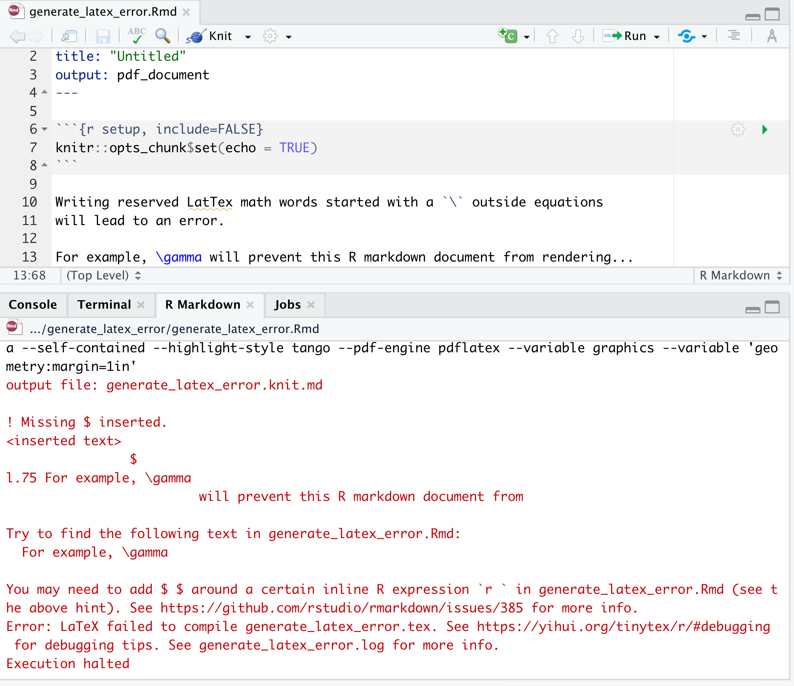

```{r setup, include=FALSE}
knitr::opts_chunk$set(echo = FALSE, message=FALSE, ft.align = "left")
library(knitr)
```

## Abstract

In the data science courses at UBC, we define data science as the study 
and development of reproducible and auditable processes to obtain value 
(*i.e.,* insight) from data. While reproducibility is core to our definition, 
most data science learners enter the field with other aspects of data science in mind, 
for example, predictive modelling being the most interesting topic to novices. 
This fact, along with the highly technical nature 
of the industry standard reproducibility tools currently employed in data science, 
present out-of-the gate challenges in teaching reproducibility in the data science classroom. 
Put simply, students are not as intrinsically motivated to learn this topic, 
and it is not an easy one for them to learn. What can a data science educator do? 
Over several iterations of teaching courses focused on reproducible data science tools and workflows, 
we have found that motivation, guided instruction 
and practice are key to effectively teach this challenging, yet important subject. 
Here we present examples of how we deeply motivate, effectively guide
and provide ample practice opportunities data science students 
to effectively engage them in learning about this topic. 

## Introduction

In the graduate and undergraduate data science courses that we teach
at the University of British Columbia (UBC), 
we define data science as the study, development, and practice of
reproducible and auditable processes to extract insight from data.
Using this definition requires that we also define
what is meant by a reproducible and auditable analysis.
To define reproducible analysis,
we embrace the National Academy of Sciences definition,
which is reaching the same result given the same input, computational methods,
and conditions [-@national2019reproducibility].
For auditable or transparent analysis,
we follow how it has been defined by Hilary Parker [-@parker2017opinionated] 
and Karthik Ram (2013),
which is that there should be a readable record of the steps used to carry out the analysis
(i.e., computer code)
as well as a record of how the analysis methods evolved
(i.e., a version controlled project history).
This history is important for recording how and why
decisions to use one method or another were made,
among other things.

The reason we embrace this definition of data science,
is that we believe that data science work should both bring insight
(e.g., answer an important research question)
and employ reproducible and auditable methods
so that trustworthy results and data products can be created.
Results and data products can be generated
without reproducible and auditable methods,
however,
when they are built this way there is less confidence
in how the results or products were created.
We believe this stems from non-reproducible and non-auditable analyses:

1. lacking evidence that the results or product could be regenerated given the same input computational methods, and conditions
2. lacking evidence of the steps taken during creation
3. having an incomplete record of how and why analysis decisions were made

In addition to contributing to the trustworthiness of data science work,
employing reproducible and auditable methods and workflows
bring additional benefits to data scientists,
such as more effective collaboration.
Data science is an inherently collaborative discipline,
and adhering to reproducible and auditable data science methods
greatly facilitates the act of collaborating in many context,
further emphasizing the importance of learning this skill well.

Although the many benefits of reproducible and auditable analyses discussed above
may make them seem like an exciting topic for incoming students,
the experience when entering a classroom of curious data scientists in training
is quite the opposite.
Students are usually keen to learn about data science
but what they're most excited about is the second part of
its definition: extracting insights from the data.

Students are often not even aware of the reproducible
and auditable processes of data science,
and when they first hear about them,
they tend to regard them as an inconvenient means to an end
rather than an important skill to master.
This outlook is likely at least in part motivated by fact that these processes
do not directly lead to novel insights
in the same way as a predictive model might,
which is what many students have in mind when they envision the work of a data scientist.
This negative predisposition creates another barrier to overcome
when teaching the reproducible and auditable aspects of data science.

An additional pedagogical challenge
is that the tools that we use for reproducibility
are not necessarily smooth and easy to learn,
but often have a steep learning curve.
Over our five years of teaching these topics at UBC
we've found three pedagogical strategies
that are particularly effective for teaching reproducibility successfully:

1. placing extra emphasis on motivation
2. guided instruction
3. lots of practice

In this paper, we will discuss why we believe each of these are important,
provide examples of how to incorporate these in your teaching.

## Placing extra emphasis on motivation

Why do we need extra motivation when teaching reproducibility, 
compared to some other data science topics, such as machine learning? 
We think this is because students do not have intrinsic excitement
or motivation for the topic of reproducibility,
they have little prior knowledge on this topic, 
and reproducibility concepts and in particular tools are challenging to learn. 

One example is that the most commonly used version control software, Git,
is notorious for being difficult to learn (Figure \@ref(fig:git-is-hard-xkcd)). 
Furthermore, there are many anecdotes that most people 
do not learn it deeply
and instead work by trying a variety of commands until they find some
that work. This can lead to learners getting themselves into challenging or 
perplexing version control situations, with difficult to interpret outputs
(e.g., "You are in 'detached HEAD' state. You can look around, make experimental changes and commit them, and you can discard any commits you make in this state without impacting any branches by performing another checkout").
Sometimes these situations are so difficult to get out of, that even professional 
data scientists and data science educators, for example Jenny Bryan,
recommend the practice of "burning it all down" and starting from scratch - 
which really defeats many of the purposes of version control.

```{r git-is-hard-xkcd, out.width="30%", fig.cap = "Infamous xkcd comic that highlights the difficulty of learning and using the version control software Git.", fig.retina=2}
include_graphics("img/git_2x.png")
```

Another example is R Markdown, 
which is an implementation of literate code documents [@knuth1984literate], 
that are useful for generating reproducible reports.
Many aspects of R Markdown are quite user friendly, 
however rendering the source R Markdown document to PDF depends on LaTeX. 
If users make formatting errors that impact LaTeX's job in the rendering
the resulting error messages can be cryptic
and are often not clear to learners about where the error is coming from
or how to resolve it.
An example of an error from including a `\`` character with a reserved 
LaTeX word outside of a mathematical equation,
and the resultant error message is shown in Figure \@ref(fig:latex-errors).
The error message here is interpretable by intermediate and experienced 
R Markdown users, but not by novice learners.

```{r latex-errors, out.width="100%", fig.cap = "Latex errors are often cryptic to new learners.", fig.retina=2}

```

Yet another example of a popular reproducibility tool that is challenging to learn is
Docker.
Docker is a containerization tool that extends beyond
just including the package dependencies of your analysis workflow,
and instead creates an versioned copy of your entire computational environment
including the programming language and any operating system dependencies.
This means that you can share an exact copy of your computational environment 
with your collaborators, even if you work on different operating systems.
Docker is an especially challenging one to
teach and motivate students to learn
because it is so different from writing code for analysis.
This is because software installation is time consuming,
which leads to writing and debugging code to automate installation
being a slow and painstaking process. 
This is especially true if certain workflows are not followed.
It is also not an exciting part of a data analysis, 
as things already work on the student's own computer. 
This makes it difficult to convince students why they should put effort into learning 
and using this.

So what do we do to motivate learning reproducibility concepts and tools in our
classrooms? We have found the following three strategies helpful:

1. Tell stories from the trenches
2. Study cases of failures with real world consequences
3. Let them fail (in a controlled manner)

### Telling stories from the trenches

One successful strategy that we have used is telling stories from the trenches.
The instructors who teach these courses at UBC usually have had some experience 
performing data analyses in their Ph.D.'s or Postdoctoral studies, 
or are still currently engaged in research where they do this.
Through these lived experiences 
of learning reproducibility tools 
and applying it to own analyses, we have made mistakes,
our collaborators have made mistakes, 
and thus we can share these experiences with our students.
In the Master of Data Science program, 
many of the students have work experience involving data in the past,
and so they also have stories from the trenches. 
In a classroom with such students, 
you can carry out think pair share exercises around these stories 
and get the students to talk about their stories as well as hear yours.

In addition to sharing some consequences of non-reproducible analysis 
with students (without them having to experience this themselves 
over a long and drawn out process of self-discovery),
these stories come from people the students know 
(their instructors and peers) and as such, 
these stories highlight how common and easy it is for such mistakes to happen, 
to anyone practising data analysis,
if care is not taken to follow reproducible workflows and practices.
This helps makes the practice of reproducibility seem more applicable 
and relatable to their own data analysis 
(which at this stage in their career, may not end up in a published paper).

### Study cases of failures with significant real world consequences

A second way to create motivation
is through using case studies of irreproducible data analyses
that have had significant real world consequences.
Such case studies can be used to illustrate the importance 
and impact of reproducible data analyses.
This is something that the authors
are currently trying to build into their courses
and yet have limited experience with,
but think the idea has strong merit and wish to present it here.
We believe that this strategy
may be particularly important for teaching reproducibility,
since the impact and significance of the consequences 
of not using reproducible practices are not obvious to novices.
By presenting case studies
where failure to adhering to reproducible practices
have led to costly mistakes,
we aim to give learners a chance to directly appreciate
the connection between the lack of reproducible workflows
and the downstream consequences.

While there are many articles outlining recommendations
on which reproducible practices to adhere to,
case studies of failures are not as frequent in the literature.
We think this partly stems from the fact
that such errors are often only discovered internally and never reported,
and that there are few incentives for people
to spend their time performing proper forensic informatics analysis on other's work.
Even so,
there are several such examples reported in the literature,
one of the most striking leading to putting patients at risk
in incorrectly administered clinical trials
which we will outline in the next paragraph [@carlson_carlson_2012].

These clinical trials took place at Duke in 2006
and involved 110 cancer patients
hoping that using personalized gene signatures
would identify which treatments were more effective for individuals [@carlson_carlson_2012].
The series of scientific papers that formed the basis of these trials
were all published in highly regarded "high-impact" journals,
but they had also raised some concerns among researchers in the field [@carlson_carlson_2012].
When put under a thorough independent review,
these papers were found to contain multiple errors, 
several related to the use of non-reproducible tools 
and workflows [@baggerly2009deriving].
In the review analysis it was highlighted that most common problems were simple
and included mistakes such as "off-by-one" errors
where a cell might have been inadvertently deleted in Excel
leading to a shift of all remaining values,
labelling mix-ups where the treated and not treated groups
were assigned labels 0 and 1 instead of meaningful names
which can lead to confusion as to which is the treated and control group,
and poor documentation practices leading to lack of transparency
which makes it harder and more time-consuming to identify errors
(both for the original authors and the reviewers).
These clinical trials were eventually terminated about four years after they started,
around 25 papers papers related to these trials were retracted,
and the lead investigators were put under investigation for malpractice.
This example highlights the enormous cost
associated with not adhering to reproducible practices
and having workflows that are opaque and hard to review.

Other examples of case studies that could be used to illustrate the significant
real world consequences of reproducibility failures in data analyses 
are listed in table 1. 

Table. 1: Case studies that illustrate the significant real world consequences of reproducibility failures in data analyses.

| Reproducibility error                                    | Consequence                                          | Source(s)                                |
|----------------------------------------------------------|------------------------------------------------------|------------------------------------------|
| Limitations in Excel data formats                        | Loss of 16,000 COVID case records in the UK          | [@kelion_kelion_2020]                    |
| Excel's automatic formatting                             | Important genes disregarded in scientific studies    | [@zeeberg2004mistaken; @ziemann2016gene] |
| Deletion of a cell caused rows to shift                  | Mix-up of which patient group received the treatment | [@wallensteen2018retraction]             |
| Using binary instead of explanatory labels               | Mix-up of the intervention with the control group    | [@wise_aboumatar_2019]                   |
| Using the same notation for missing data and zero values | Paper retraction                                     | [@turchin_whitehouse_2021]               |
| Incorrectly copying data in a spreadsheet                | Delay in the opening of a hospital                   | [@picken_picken_2020]                    |

### Letting them fail (in a controlled manner)

Many instructors (including the authors of this work)
have themselves experienced failure in graduate school
and during their postdoctoral research in regards to reproducibility,
which negatively impacted their work.
While these experiences motivate teaching and using
reproducibility concepts and tools for instructors,
most undergraduates and new graduate students cannot draw on similar professional experiences.
Rather than letting new students live through the full perils of irreproducible research,
we can set up controlled scenarios to expose them to these downsides
in a controlled, accelerated manner
while still embodying much of the same motivational benefits.

One way we have done this is providing students an analysis that is not 
reproducible 
(i.e., it depends on rare/obscure software packages 
or specific package versions), 
and thus will likely fail on someone else's machine. 
We then ask them to try to run it, 
and if they cannot run it, we ask them to fix the code 
or install missing software so they can.
Then we provide them the same analysis that has been made reproducible, 
through the use of shareable compute environments (i.e., `renv`, `conda`, or Docker),
instructions on how to use the shared compute environment.
The students then experience running the same analysis on their machines 
without any changing of code or software installation.
Under these controlled circumstances
failure and frustration can have a positive impact on students overall learning
as they experience the many benefits of reproducibility first hand.
In a relatively short amount of time,
this helps provide motivation
to endure the steep learning curves of reproducibility concepts and tools.

The example discussed above was inspired by Jenny Bryan's teaching of STAT 545 at UBC.
In her version of this task, she pairs students up and asks them to 
run each other's code projects that they have been working on in her course. 
Most usually fail to be able to do this on the first try 
for the same reasons discussed above.
We adapted her teaching method so that students experience this 
in a more limited, controlled manner - 
which has allowed us to scale this exercise to larger classes 
with more homogeneous experiences.

## Guided instruction

In our teaching
we primarily seek to facilitate students' learning
and encourage them to take initiative and responsibility for their own learning experience.
Here, we suggest that guided instruction is helpful
to set students off on the right path as they take an active role in their own learning,
particularly when teaching reproducibility.
From our experience, reproducibility is not something that most people or
students figure out on their own, 
or if they do, it is not an efficient process. 
We hypothesize the reason for this is that reproducibility 
uses a lot of borrowed knowledge, workflows 
and tools from software engineering that are
being repurposed for science and reproducibility.
Thus, much of the getting up and getting started with reproducibility 
has a lot of assumed knowledge behind it, 
and at present there are not many clear and easy on-ramps for learners who
do not have a software engineering background. 
Part of this may stem from the field being still fairly new 
and not-yet as widely embraced as we might hope.
This means that there is not a lot of culture around using reproducibility tools in data science
and statistics, and it is not yet as obvious where the on-ramps are.

Furthermore, similar to why we need extra motivation, 
the challenge of learning to use the tools due to their steep learning curves
suggests that having some guided instruction is beneficial to learners. 
These points are well stated in a 
[blog post](https://simplystatistics.org/2018/12/11/the-role-of-theory-in-data-analysis/) 
and [essay](https://leanpub.com/dataanalysisessays) 
on *The Role of Theory in Data Analysis* by Roger Peng [-@peng2020essays]:

> *There is no need for a new data analyst to learn about reproducibility* 
> *"from experience".* 
> *We don't need to lead a junior data analysis down a months-long*
> *winding path of non-reproducible analysis until they are finally bitten* 
> *by the non-reproducibility bug (and "therefore learn their lesson").* 
> *We can just tell them*
>
> *"In the past, we've found it useful to make our data analysis reproducible*
> *Here's a workflow to guide you in your own analysis."*
> 
> *Within that one statement, we can "compress" over 20 years of experience.*

The authors of this article agree with the statement above 
and think we owe it to our students to guide them
to the best practices that the reproducibility community has
arrived on to date and then show them how to use these tools explicitly.

At UBC,
we primarily employ guided instructions through three pedagogical strategies:

1. Live demonstration
2. Pre-lecture activities
3. Worksheets

### Live demonstration

So how do we use guided instruction in the reproducibility classroom? 
In data science programming classes it is becoming more common to use demonstration 
to show how to code in R and Python. 
This is referred to in the data science literature as live coding 
[@raj2018role; @nederbragt2020ten]. 
We have observed that a similar pedagogy of live demonstration 
works well for reproducibility tools, 
including R Markdown [@xie2021dynamic] or Jupyter notebooks [@kluyver2016jupyter] for reproducible reports, 
using version control with Git and GitHub, 
and using tools like `renv` [@kusheyrenv], `conda` [@anaconda]
and Docker [@merkel2014docker] to create reproducible and shareable computational environments.
We believe that live demonstration makes it more obvious to the students 
how to use these tools in practice,
and facilitates lateral knowledge transfer
where learners absorb additional material by observing *how* we work,
which would not have been possible from learning about these
concepts and tools in a traditional lecture that uses a slide deck
to present new knowledge and concepts.
Additionally, when you make mistakes as an instructor in these live demonstrations,
it humanizes the reality of working with these tools that are
somewhat challenging even for experts,
and intentional mistakes can provide opportunities to spend more time on
that area of the topic and explain the gotchas of a common mistake,
and how to fix it [@wilson_wilson_2018].

A word of caution with live demonstration when teaching reproducibility;
because teaching these workflows and tools often involves
the demonstrations of graphical user interfaces 
and tools that come from software engineering, 
the tech stack moves very fast. 
This means that each semester we teach these tools,
we need to test drive the materials before we share them with the students
to see if something has changed - as often it has.
This is something that happens less frequently when teaching 
novice to intermediate programming for data science, 
as that part of the data science software stack has now become fairly stable.
A relatively recent example of this is from fall 2020, 
when GitHub decided to change the name of their default branch 
from master to main (rightfully so) [@__ak]. 
This change broke several of our teaching demonstrations,
guided worksheets, and lab homework.
It also caused all of our notes to have to be rewritten. 
For the reasons argued above, we do believe that it is really important 
to use guided instruction when teaching reproducibility, 
however, this should be done with the awareness and the acceptance 
that these kinds of changes are going to happen relatively frequently.
Which means reproducibility instructors are going to have to 
update or make a new live demonstrations, and other teaching resources, 
each year.
Without this, the course resources will quickly fall out of usefulness.
There may be a time in the near future where these tools also stabilize,
but the authors of this manuscript anticipate that is still 
many years ahead in the future.

### Pre-lecture activities

Although live demonstration is important for the reasons outlined above,
it is critical that it does not dominate the time spent in the classroom,
so that student have ample time to engage in active learning activities.
There is evidence that active learning can increase student performance,
at least on summative assessments [@freeman2014active].
To ensure that students have sufficient background knowledge
to start we complement our live demonstration with assigned pre-lecture activities.
These can consist of material that we have created ourselves or external resources
and is usually in the form of reading material or videos.
Encouraging students to learn the basics before class
allows us to have more meaningful live demonstrations
and sets students up for a more effective learning experience
by spacing out their exposure to the course material.

### Worksheets

After guiding students through the fundamentals
through live demonstration and pre-lecture activities,
we challenge them to take a more active learning role
by solving worksheet problems on their own in the classroom.
This activity occupies most of the in-class time,
so that students can engaging actively with the material
in an environment where they can easily be supported,
before working on the homework assignments on their own.
Worksheets provide students with many low stakes assessments
comprised of short problems that are graded for completion only.
In data science,
this works well in literate code documents 
(either Jupyter notebooks or R Markdown)
that have automated tests in them to provide feedback. 
Two tools that we have used for this are nbgrader [@blank2019nbgrader] 
and otter-grader [@otter].
Compared to in-class exercises,
worksheets give learners an additional chance to actively engage with the material
while still providing a structured way of providing exercises 
focused on key learning outcomes.
Worksheets are also key for providing students with lots of practice,
a topic we discuss in the last section of this article.

### Example lesson using guided instruction

Here we provide an example of how we use guided instruction to teach version
control in our first year introduction to data science course at UBC, DSCI 100. 
In this course, we take a three-pronged approach for guided instruction.

First, we provide them an assigned textbook reading
for them to review before class. 
For this particular topic, it is an [introductory chapter 
on collaboration with version control](https://ubc-dsci.github.io/introduction-to-datascience/Getting-started-with-version-control.html).
When the students arrive in class, 
we then do a live demonstration, 
where they watch us use the GitHub website, 
and the Jupyter Git graphical user interface to add, commit,
push and pull changes.
A recording of one of these live demonstrations is available on YouTube at this [link](https://youtu.be/attPo4zEElU).
Finally we ask the students to work through a 
guided worksheet, which is a Jupyter notebook with narration, questions and automated software tests to give automated feedback about their answers.
The worksheet asks the students to do 
the same thing that we just demonstrated,
as well as asks them questions along the way 
to test their understanding of the reproducibility concepts 
related to the skills and tools they are practicing.
For example, in the version control worksheet, we ask questions to assess
if they understand what the purpose of adding something to the Git staging area is, 
how adding differs from committing in Git, 
and where does the work go when it is pushed to a remote repository. 
An version of this worksheet can be accessed [here](https://github.com/UBC-DSCI/dsci-100-assets/blob/master/2021-summer/materials/worksheet_05/worksheet_05.ipynb)

The challenge or limitation with this lesson in particular, 
is that we have chosen to teach using a Git graphical user interface,
as opposed to the Git command line tool,
due to the very novice level of the learners in this course. 
Using a graphical user interface, and a newer one,
means that we need to more frequently update
and fix our lesson as the tool changes. 
The Git command line tool is more stable, and command line tools have less
room to change generally, compared to graphical user interfaces, 
and thus would be a more stable tool to build a lesson around. 
However, the trade-off would be that this is a bit less intuitive for new learners,
especially those who are also new to the command line in general.

## Lots of practice

The third pedagogy we argue for when teaching reproducibility is lots 
and lots of practice.
Mastery of a subject often involves consolidating ideas, concepts 
and theories into long-term memory. 
And consolidating most things into long-term memory 
requires repetition [@ebbinghaus1913memory].
When we teach reproducibility topics,
we want students to do more than commit information to long-term memory.
We want to go a step further, beyond knowledge of ideas, concepts and theories,
and induce a change in their behavior,
both in the classroom and in their own work.
We might even say, that we want our students to form new 
habits around how they perform data analyses, ones that are reproducible.
Importantly and in contrast to many other data science topics,
students often already have behavioral patterns in place for how they organize 
and name their files, or how they collaborate with their colleagues.
However, most often these are not reproducible practices 
and this prior knowledge 
and practices can interfere with learning the new behaviours 
we want our students to adopt. 
Thus, for those two reasons stated above,
we argue that reproducibility requires more practice compared to other
data science topics. 

Habit formation can be defined as the triggering of behavior from contextual cues [@rebar_gardner_2019].
In the context of reproducible workflows these cues
are the tasks that students desire to execute,
such as saving a file after adding new content
or wanting to share a document with a colleague.
When teaching reproducible workflows
we are aiming to replace the behavior with a more reproducible version
as a response to the same cue.
Although it might sounds like a complex task to not just unlearn an old behavior,
but also learn a new one,
studies has shown that behavioral change is in fact facilitated
when substituting a desirable habit for an undesirable one existing
rather than simply trying to unlearn the existing habit
[@evers_adriaanse_2011].

Habitual behavior has been proposed to protect individuals from motivational lapses,
where a desired good behavior is not expressed
due to a momentary lack of willpower [@rebar_gardner_2019].
By promoting the formation of habits in students,
they opt for the reproducible workflow "by default",
shielding them from relying on willpower to not "take the easy way out"
and employ in a familiar, but irreproducible fashion workflow strategy.

Habits are best learned through frequent, regular, and sustained cue exposure.
To support the formation of reproducible workflow habits,
we therefore complement guided instruction
with plenty of embedded practice in the classroom,
where we intentionally pause during the demos
and say "okay students your turn, do what i just did".
This is a more controlled form of practice,
which sets students up for practicing these habits on their own.
As mentioned above,
we also provide students with worksheets
that can be used both in the class room and at home,
as students receive feedback through automated software tests.

Importantly,
habit formation is not a linear process.
Instead,
each successful action following a cue,
adds to the formation of a new habit in an asymptotic fashion,
where the initial events are the most important
and the learning rate eventually plateaus as the habitual pattern solidifies.
While popular literature often refers to ~30 days as "all it takes"
to develop a new habit,
studies have reported that the median is at least around 70 days [@wardle_lally_2010; @radel_fournier_2017]
before reaching the plateau phase of habit development.
We therefore believe it is paramount
that learners have sustained frequent practice in reproducible workflows,
which is interleaved with other topics
where they would employ and benefit from these skills in real life.

To give students adequate time and practice to cement their reproducible workflow habits,
we have made intentional choices of which learning technologies and platforms
are used throughout UBC Master of Data Science program.
This ensures that students are practicing using reproducible tools
for the full 10 months as part of the course learning technology mechanics
(homework submission, grading, etc).
Additionally, we interleave these practices as 
"mechanical assignment requirements" worth a small percentage of their 
grade while completing assignments focused on other data science topics.
This latter strategy parallels how they will employ reproducibility 
habits later in their carers
(a detailed example follow in the next section).
We also intentionally choose to use authentic data science reproducibility tools
to provide opportunities for practicing and gaining confidence with these tools
in "sharp" authentic scenarios rather than just in constructed exercises.
This sustained practice not only enforces students' habits,
but also increases their proficiency with these tools
and they can run into problems in an environment
where they can easily reach out for help without feeling intimidated to ask.

### Example lesson(s) of lots of practice

A specific example of how we use lots of practice
is used in almost all of the UBC Master of Data Science courses
(which has 20 one-credit courses taken over an eight-month period).
In these courses we use version control,
particularly Git and GitHub as our course management system. 
In these courses, the homework instructions and assignments are distributed 
to the students as GitHub repositories and the only way that they can submit
their homework is by putting their homework in that GitHub repository.
Thus, to complete and submit their assessments 
on any data science topic students must go through the cloning procedure,
or at least be able to somehow download their assignments from the
GitHub website, as well as be able to 
(hopefully through using Git) upload their work back to that GitHub 
repository. The tool we use to administer GitHub repositories in this way
is called `rhomboid` (https://github.com/mgelbart/rhomboid), 
but there are other tools that can do this, 
including GitHub Classroom (https://classroom.github.com/) 
and Classy (https://github.com/ubccpsc/classy).

To incentivize doing this using Git 
(as opposed to the GitHub web user interface)
we also assign some marks of each assignment (about 5%) to a mechanics grade. 
For this we assess whether they have at least three
commits associated with every single assignment
and have written meaningful commit messages.
By the end of this program the students have version controlled their
work in over 80 different GitHub repositories.
We hope this results in using version control becoming a habit, 
to the point that if they're going to work on a project
it's going to go under version control by default - 
even when they leave the program
and are no longer receiving grades for doing this.

One exciting technology that we have recently started incorporating
in our teaching of reproducible workflows is GitHub actions.
This tool has allowed us
to automate the building of individual "playgrounds" of complex Git scenarios
that would take much effort and typically fail to stage in a large classroom.
One of the GitHub repositories that we created for these activities
(https://github.com/ttimbers/review-my-pull-request)
serves the purpose of providing a playground
where students can explore and practice
to learn how to use GitHub's code review feature for pull requests.
To use it,
students create their own copy of the repository on GitHub,
create a branch named `pr` 
and then a pull request is automatically created for them by a bot.
After this quick and simple setup,
the students can spend the rest of the exercise
exploring how to perform code reviews on GitHub.

## Conclusions

We think over the past five years
from teaching in the UBC Master of Data
Science and the UBC introductory data
science course that key things for teaching reproducibility
in the data science classroom are 
*1)* providing extra emphasis on motivation 
so that students understand why reproducibility is important and
buy into learning about it and practicing it, 
*2)* providing guided instruction so that it is not
a mystery of how you get started and what you need to do,
as well as *3)* lots and lots of practice so that we
can not only teach them the ideas and the
concepts behind reproducibility, but so that students actually
change their data analysis habits and workflows into reproducible ones
that they will use after leaving the classroom.

## References
